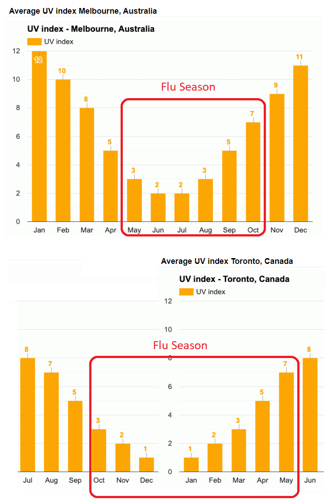

# uv-times-hours-sunlight
Is a cities flu susceptibility correlated with the amount and intensity of sunlight? Could this be useful for the recent covid-19 outbreak. Obviously other factors are involved with the coronavirus spread.

Website of demos at https://hpssjellis.github.io/uv-times-hours-sunlight/public/index.html

Does anyone have any good datasets of UV and Hours of sunlight and covid-19 cases per city?

Here is what I have found so far.

I have too much time on my hands so I have been really pondering why the typical flu fades around March-April each year and a few web pages have mentioned that UV light has something to do with it. 

UV light is just intensity and does not make any sense for flu reduction with people inside buildings, herd immunity probably is more important inside, but for outside flu contamination it does make some sense. However intensity alone is probably not as important as intensity x amount of sunshine. Looking at global data that metric starts making more sense.

https://www.webmd.com/cold-and-flu/news/20180212/can-uv-light-be-used-to-kill-airborne-flu-virus-#1 

https://www.ncbi.nlm.nih.gov/pmc/articles/PMC6466003/

https://www.sciencedaily.com/releases/2018/02/180209100701.htm
 
 

coronavirus kaggle dataset updated often

https://www.kaggle.com/sudalairajkumar/novel-corona-virus-2019-dataset

weather conditions task kaggle

https://www.kaggle.com/sudalairajkumar/novel-corona-virus-2019-dataset/tasks

https://www.worldometers.info/coronavirus/

# UV x Sunlight Index 

(At what Index value does the flu (or covid19) typically see a reduction)

## UV index x hours of sunshine per day per city = 

# Milan

https://www.weather-atlas.com/en/italy/milan-climate#uv_index

https://en.wikipedia.org/wiki/List_of_cities_by_sunshine_duration

Jan 1x59  =   59

Feb 2x96  =  192

Mar 3x152 =  456

Apr 5x177 =  885

May 7x211 = 1477

Jun 8x243 = 1944

# Tokyo

https://www.weather-atlas.com/en/japan/tokyo-climate#uv_index
https://en.wikipedia.org/wiki/List_of_cities_by_sunshine_duration

Jan 2x184.5   =  369

Feb 3x165.8   =  498

Mar 5x163.1   =  816

Apr 7x176.9   = 1389

May 9x198.4   = 1786

June 10x125.4 = 1254

# New York

https://www.weather-us.com/en/new-york-usa/new-york-climate#uv_index

https://en.wikipedia.org/wiki/List_of_cities_by_sunshine_duration

Jan 2x163 =  326

Feb 3x163 =  489

Mar 4x213 =  852

Apr 6x226 =  1356

May 7x257 =  1799

Jun 8x257 =  2056

# Tehran

https://www.weather-atlas.com/en/iran/tehran-climate#uv_index

https://en.wikipedia.org/wiki/List_of_cities_by_sunshine_duration

Jan 3x137   =  411

Feb 4x151   =  604

Mar 6x186   = 1116

Apr 8x219   = 1752

May 11x280  = 3080

June 12x329 = 3948

# Vancouver

https://www.weather-ca.com/en/canada/vancouver-climate#uv_index

https://en.wikipedia.org/wiki/List_of_cities_by_sunshine_duration

Jan 1x60  = 60

Feb 1x91  = 91

Mar 3x135 = 405

Apr 4x185 = 740

May 6x223 = 1338

Jun 6x227 = 1362

# Possible analysis

CovidFactor is the monthly unknown = bad luck, cultural issues (Iran:Kissing statues, Italy:close contact ) cultural positives (Japan bowing, masks when sick), prevention (Social distancing, handwashing)

UV = months average UV index
HSL = average hours of sunlight per month 
What is the covidFactor CF per city

CF x UV X SL = Cases per month per city

# articles

https://www.infectioncontroltoday.com/personal-protective-equipment/studies-stir-new-debate-about-influenza-virus-size-transmission-risk

Quote:

 They found that the fine particles had 8.8 times more virus than the coarse particles (larger but still airborne droplets). They also tested the airborne droplets for "culturable" virus and found that virus was not only abundant in some cases, but infectious. However, there was a big range of how many viruses people put into the air some were undetectable while others put out over 100,000 every 30 minutes. 
 
 
 The researchers add, "The size of airborne particles determines how influenza virus is transmitted. Large particles (diameter, =20 µm) have limited travel distance, while smaller particles (diameter, <5 µm) stay airborne longer and spread widely. We found that up to 89 percent of influenza viruscarrying particles were <4.7 µm in diameter.
 
 Routes of flu transmission include: 1) direct or indirect (e.g., doorknobs, keyboards) contact with an infected person, 2) contact via large droplet spray from a respiratory fluid (via coughs and sneezes), and 3) inhalation of fine airborne particles, which are generated by the release of smaller, virus-containing droplets via normal breathing and coughing. 
 
 
End of quotes:

If just breathing releases very small particles of a virus that might help explain why the flu is in part reduced as the UV index increases. these very small particles might be dried out and destroyed faster with increased UV radiation?

Large particles spread by a cough or sneeze could still infect people not wearing masks and social distancing.
